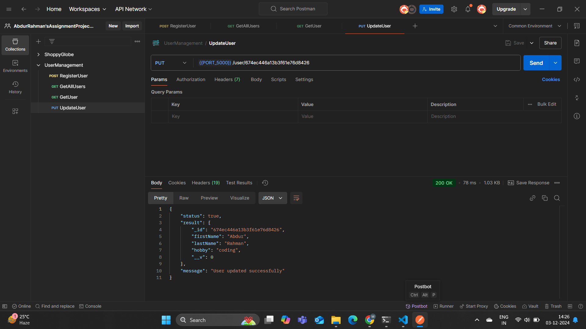
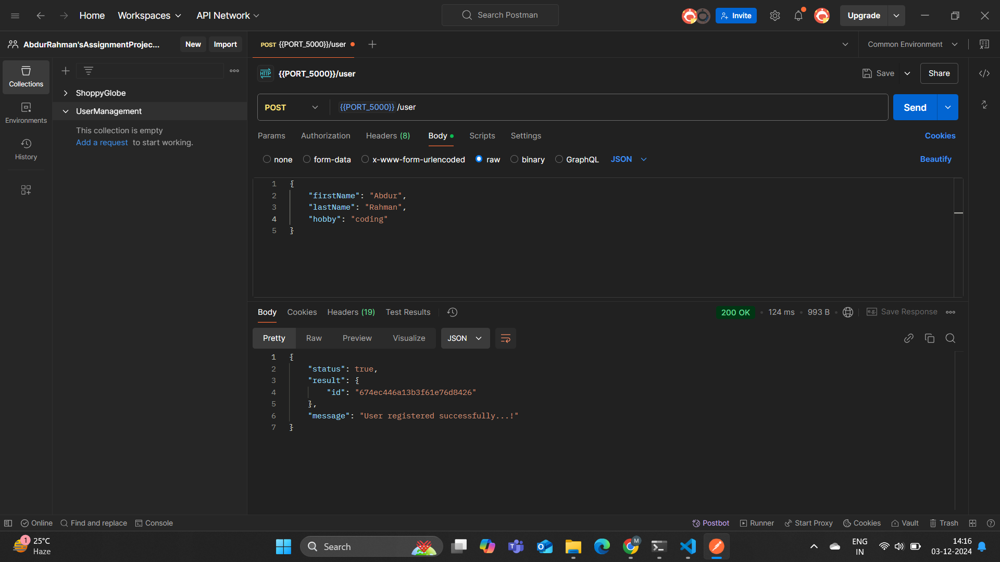
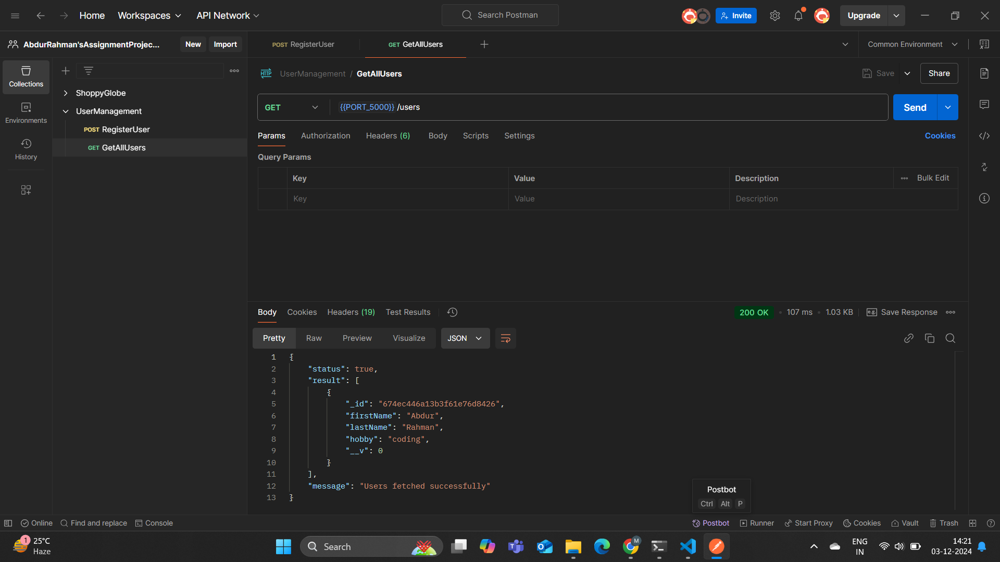
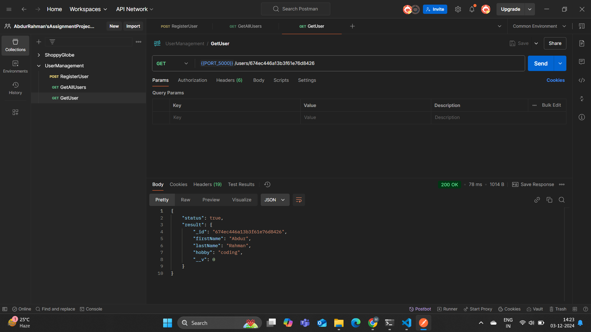
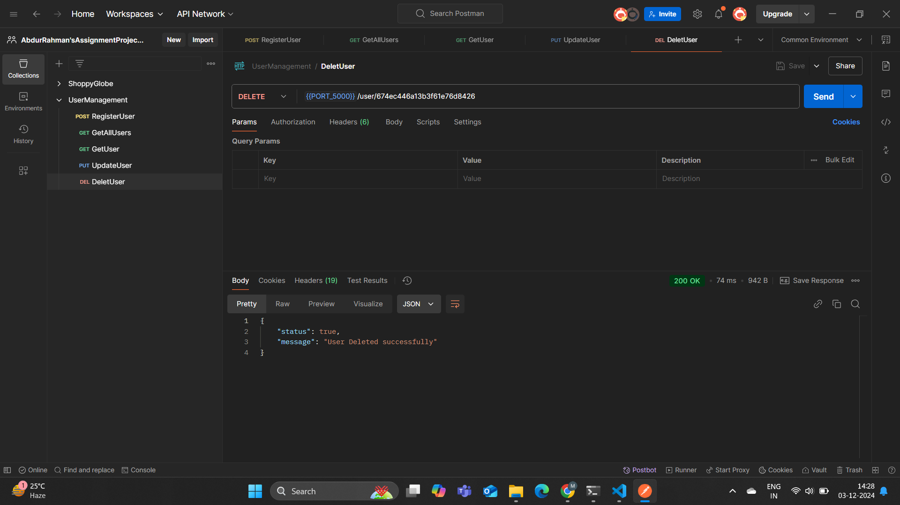

# RESTful API with Node.js and Express

## Project Description

This project demonstrates a simple RESTful API built with Node.js and Express. It is designed to manage a list of users, allowing you to perform basic CRUD (Create, Read, Update, Delete) operations. The application implements key concepts such as routing, middleware, HTTP methods, status codes, error handling, and data validation.

## Features

- **CRUD Operations**: Manage users with endpoints to create, read, update, and delete.
- **Middleware**:
  - Logs request details (method, URL, status code).
  - Validates input data for `POST` and `PUT` requests.
- **Error Handling**: Returns meaningful error messages with appropriate status codes.
- **In-Memory Data Storage**: Uses an array to store user data.

---


## Screenshot







## API Endpoints

### 1. `GET /users`
- **Description**: Fetch the list of all users.
- **Response**:
  - `200 OK`: Returns an array of users.

### 2. `GET /users/:id`
- **Description**: Fetch details of a specific user by their ID.
- **Response**:
  - `200 OK`: Returns the user object.
  - `404 Not Found`: If the user ID is not found.

### 3. `POST /user`
- **Description**: Add a new user.
- **Request Body**:
  ```json
  {
    "id": "1",
    "firstName": "John",
    "lastName": "Doe",
    "hobby": "Reading"
  }


# Github repositorylink :
#    https://github.com/Mdabdur01/User-Management.git